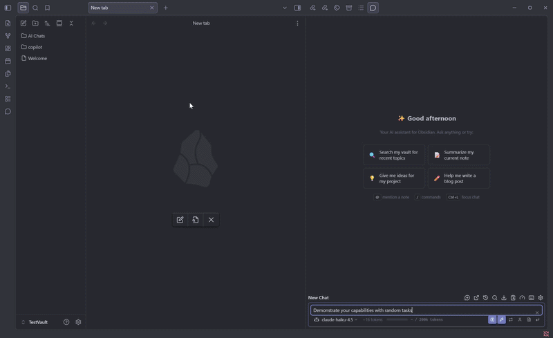
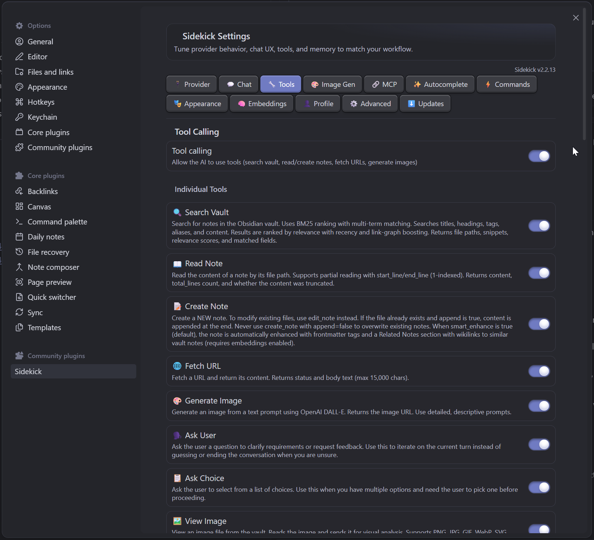
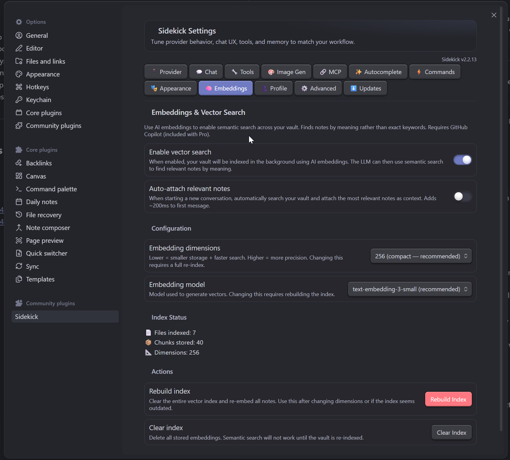
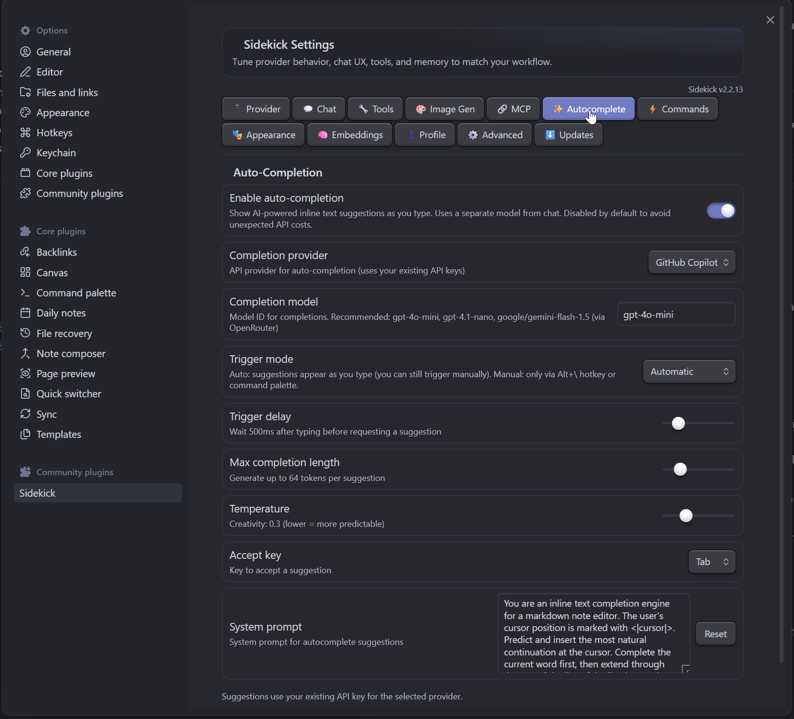
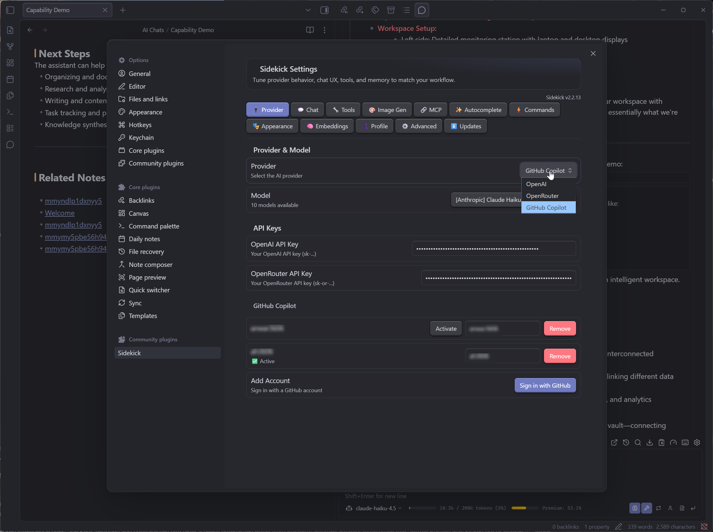

<p align="center">
  <h1 align="center">Sidekick</h1>
  <p align="center">
    <strong>AI assistant that lives inside your Obsidian vault</strong>
  </p>
  <p align="center">
    Chat with 30 tools · 8 agent presets · inline autocomplete · 3 providers
  </p>
  <p align="center">
    <a href="https://github.com/anwar3606/obsidian-sidekick-ai/releases/latest"></a>
    <a href="https://github.com/anwar3606/obsidian-sidekick-ai/blob/main/LICENSE"></a>
    <a href="https://github.com/anwar3606/obsidian-sidekick-ai/actions/workflows/release.yml"></a>
  </p>
  <p align="center">
    <a href="https://github.com/anwar3606/obsidian-sidekick-ai/issues">Report Bug</a>
    ·
    <a href="https://github.com/anwar3606/obsidian-sidekick-ai/issues">Request Feature</a>
  </p>
</p>

<p align="center"></p>

---

Sidekick is a multi-provider AI chat assistant for [Obsidian](https://obsidian.md), primarily inspired by the **VS Code GitHub Copilot Chat** extension. It brings the same powerful chat + tools + inline autocomplete workflow to your Obsidian vault. It opens as a sidebar panel and can search your vault, read and create notes, generate images, browse the web, and more — all through natural conversation. It works with **OpenAI**, **OpenRouter**, and **GitHub Copilot** (free tier included).

## Quick Start

1. **Install** the plugin ([instructions below](#installation))
2. **Add your API key** in Settings → Sidekick
3. **Click the chat icon** in the sidebar — done

## Why Sidekick?

Most AI plugins give you a chatbox and nothing else. Sidekick gives the AI **30 tools** to actually interact with your vault — search, read, create, edit, move, and delete notes; browse files and tags; fetch URLs; generate images; and even search Reddit and Jira. Combined with **agent presets** and **inline autocomplete**, it's less of a chat plugin and more of a co-pilot for your knowledge base.

**Your data stays yours.** Sidekick sends messages only to the provider you choose. No telemetry, no analytics, no third-party servers. Conversations are saved as plain markdown files in your vault.

## Features

### Chat & Conversation
- **Streaming responses** with real-time thinking/reasoning display
- **Chat persistence** — conversations saved as markdown in your vault
- **Conversation management** — multiple chats, pinning, search, export
- **Custom slash commands** — define your own `/commands` with custom system prompts

### Tools & Agents
- **30 built-in tools** — the AI decides what to use based on your request
- **8 agent presets** — switch between specialized personas in one click
- **Sub-agents** — delegate complex multi-step tasks
- **Tool approval** — risky tools (create/delete/fetch) require your confirmation

<p></p>

### Intelligence
- **User profiling** — learns your preferences over time for better responses
- **Auto-RAG** — automatically finds relevant notes via embeddings before answering
- **Smart search** — BM25 + fuzzy matching + graph boost + recency weighting

<p></p>

### Writing
- **Inline autocomplete** — ghost text suggestions as you type (Tab to accept, Escape to dismiss)
- **Diff view** — see proposed edits before applying them

<p></p>

### Providers
- **OpenAI** — GPT-4o, GPT-4.1, o3, o4, DALL-E, and more
- **OpenRouter** — 200+ models from Anthropic, Google, Meta, Mistral, DeepSeek, etc.
- **GitHub Copilot** — works with your existing Copilot subscription (including free tier)

<p></p>

## Screenshots

<details>
<summary><strong>Provider & Model Settings</strong></summary>
<p></p>
</details>

<details>
<summary><strong>Tool Calling</strong></summary>
<p></p>
</details>

<details>
<summary><strong>Inline Auto-Completion</strong></summary>
<p></p>
</details>

<details>
<summary><strong>Embeddings & Vector Search</strong></summary>
<p></p>
</details>

## Agent Presets

Switch personas instantly for different tasks:

| Preset | Description |
|--------|-------------|
| 🤖 **Default** | General-purpose assistant |
| 💻 **Code Expert** | Senior engineer — reviews, optimizes, explains code |
| ✍️ **Writing Coach** | Improves clarity, tone, and structure |
| 🔬 **Research Assistant** | Deep-dives into topics with citations |
| 🎓 **Socratic Tutor** | Teaches through questions, not answers |
| 💡 **Brainstorm Partner** | Generates and riffs on ideas |
| 📝 **Markdown Editor** | Formats, restructures, and polishes notes |
| 🔧 **Debugger** | Finds and fixes bugs step by step |

## Tools

The AI can call these tools autonomously during conversation:

| Category | Tools |
|----------|-------|
| **Vault** | `search_vault` · `read_note` · `read_note_section` · `read_note_outline` · `create_note` · `edit_note` · `move_note` · `delete_note` · `open_note` |
| **Browse** | `list_files` · `grep_search` · `search_by_tag` · `get_recent_notes` · `get_open_notes` · `get_backlinks` · `get_note_metadata` |
| **Web** | `fetch_url` · `search_reddit` · `read_reddit_post` · `jira_search` · `jira_get_issue` |
| **Media** | `generate_image` · `view_image` |
| **AI** | `semantic_search_vault` · `suggest_notes` · `sub_agent` |
| **User** | `ask_user` · `ask_user_choice` · `remember_user_fact` |

## Slash Commands

| Command | Description |
|---------|-------------|
| `/help` | Show command list |
| `/note` | Attach active note as context |
| `/selection` | Attach selected text as context |
| `/regen` | Regenerate last response |
| `/clear` | Clear current chat |
| `/export` | Export chat to a markdown note |
| `/new` | Start a new conversation |
| `/agent` | Switch agent preset |
| `/profile` | Show learned user profile |
| `/web` | Search the web |

## Installation

### BRAT (Recommended for now)

1. Install [BRAT](https://github.com/TfTHacker/obsidian42-brat) from Community Plugins
2. BRAT → Add Beta Plugin → `anwar3606/obsidian-sidekick-ai`
3. Enable "Sidekick" in Community Plugins

### Manual

1. Download `main.js`, `manifest.json`, and `styles.css` from the [latest release](https://github.com/anwar3606/obsidian-sidekick-ai/releases/latest)
2. Create `<your-vault>/.obsidian/plugins/sidekick/`
3. Copy the three files into that folder
4. Restart Obsidian → Settings → Community plugins → Enable "Sidekick"

## Configuration

### OpenAI
1. Get an API key from [platform.openai.com](https://platform.openai.com/api-keys)
2. Settings → Sidekick → Provider: OpenAI → paste your key

### OpenRouter
1. Get an API key from [openrouter.ai](https://openrouter.ai/keys)
2. Settings → Sidekick → Provider: OpenRouter → paste your key
3. Access to 200+ models including Claude, Gemini, Llama, Mistral, and more

### GitHub Copilot
1. Settings → Sidekick → Provider: GitHub Copilot
2. Click "Sign in with GitHub" — authenticates via OAuth device flow
3. Works with any Copilot plan including the free tier

## Privacy

- **No telemetry.** Sidekick collects nothing.
- **No middleman.** Messages go directly from your machine to the provider you chose (OpenAI, OpenRouter, or GitHub).
- **Local storage.** Conversations are saved as markdown files in your vault — visible, searchable, and yours.
- **Open source.** Every line of code is auditable in this repository.

## FAQ

<details>
<summary><strong>Does it work on mobile?</strong></summary>

Yes. The plugin is not desktop-only. However, inline autocomplete (ghost text) is currently desktop-only due to CodeMirror limitations on mobile.
</details>

<details>
<summary><strong>Which provider should I use?</strong></summary>

- **GitHub Copilot** — easiest to start with (free tier, no credit card). Limited to models GitHub offers.
- **OpenAI** — best for GPT models and DALL-E image generation. Pay-as-you-go.
- **OpenRouter** — most model variety (200+). Pay-as-you-go with very competitive pricing.
</details>

<details>
<summary><strong>Can I use local/self-hosted models?</strong></summary>

If your local server exposes an OpenAI-compatible API (e.g., Ollama, LM Studio, vLLM), you can point OpenAI or OpenRouter provider URLs to it.
</details>

<details>
<summary><strong>Where are conversations stored?</strong></summary>

As markdown files in your vault under `Sidekick/conversations/` (configurable in settings). They're regular notes — you can search, link, and edit them.
</details>

## Contributing

Contributions are welcome! The codebase is split into two layers:

- **`lib/`** — Pure logic with zero Obsidian dependencies (independently testable)
- **`src/`** — Obsidian UI layer that imports from `lib/`

```sh
# Requires Node.js >= 25 and pnpm
pnpm install
pnpm dev          # watch mode
pnpm build        # production build
pnpm test         # 1,500+ tests
```

## License

[MIT](LICENSE)
